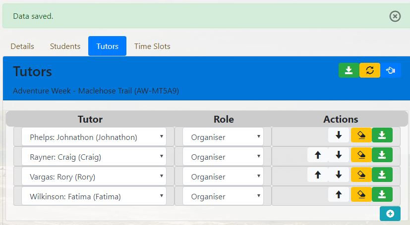

##Using Collections


This package uses and acknowledges the work done in the [ninsuo/symfony-collection](https://github.com/ninsuo/symfony-collection)
With the exception of instructions found below, the use of the collection package is found on [Symfony Collection jQuery Plugin](https://symfony-collection.fuz.org/symfony3/)
by [Alain Tiemblo](https://stackoverflow.com/users/731138/alain-tiemblo).

This collection strategy is defined for use with Doctrine entities, providing a sort, add and removal function within the 
collection.

###Coding and Templating your Collection
####Forms
The colletion type provided by Symfony is replaced by CollectionType in the form package.  An example of the form is:
```
<?php
namespace App\School\Form;

...
use Hillrange\Form\Type\CollectionType;
...
use Symfony\Component\Form\AbstractType;
...

class ExternalActivityType extends AbstractType
{
    /**
	 * {@inheritdoc}
	 */
	public function buildForm(FormBuilderInterface $builder, array $options)
	{
		$builder
			...
            ->add('tutors', CollectionType::class,
                [
                    'entry_type' => ActivityTutorType::class,
                    'allow_add' => true,
                    'allow_delete' => true,
                    'allow_up' => true,
                    'allow_down' => true,
                    'sequence_manage' => true,
                ]
            )
		...
		;
```
This is an example of the parent type, using all but the **unique_key** option, which defaults to **id**.
Calling the CollectionType add a couple of extra defaults to the options from the standard CollectionType. These are:
```
    /**
     * @param OptionsResolver $resolver
     */
    public function configureOptions(OptionsResolver $resolver)
    {
        $resolver->setDefaults(
            [
                'unique_key' => 'id',
                'sort_manage' => false,
                'allow_up' => false,
                'allow_down' => false,
            ]
        );
    }
```
The defaults mirror some of the jquery collection options (allow_up, allow_dowm) and other are created to set the form 
and code in the package.
* unique_key: Defaults to *id* which most entities use as a unique id in doctrine.  You can use another unique key in 
your entity by defining this option.
* sort_manage: Turn on the package sort options.
* allow_up: Allow an element to be moved up in the order.
* allow_down: Allow an element to be moved down in the order.
```		
<?php
namespace App\School\Form;

use App\Core\Type\SettingChoiceType;
use App\Entity\Activity;
use App\Entity\ActivityTutor;
use App\Entity\Person;
use App\Entity\Student;
use Doctrine\ORM\EntityRepository;
use Hillrange\Form\Type\EntityType;
use Hillrange\Form\Type\HiddenEntityType;
use Symfony\Component\Form\AbstractType;
use Symfony\Component\Form\Extension\Core\Type\HiddenType;
use Symfony\Component\Form\FormBuilderInterface;
use Symfony\Component\OptionsResolver\OptionsResolver;

class ActivityTutorType extends AbstractType
{
    /**
	 * {@inheritdoc}
	 */
	public function buildForm(FormBuilderInterface $builder, array $options)
	{
		$builder
            ->add('role', SettingChoiceType::class,
                [
                    'label' => 'activity_tutor.role.label',
                    'help' => 'activity_tutor.role.help',
                    'placeholder' => 'activity_tutor.role.placeholder',
                    'setting_name' => 'tutor.type.list',
                ]
            )
            ->add('activity', HiddenEntityType::class,
                [
                    'class' => Activity::class,
                ]
            )
            ->add('tutor', EntityType::class,
                [
                    'class' => Person::class,
                    'choice_label' => 'fullName',
                    'label' => 'activity_tutor.tutor.label',
                    'help' => 'activity_tutor.tutor.help',
                    'placeholder' => 'activity_tutor.tutor.placeholder',
                    'query_builder' => function(EntityRepository $er) {
                        return $er->createQueryBuilder('p')
                            ->where('p NOT INSTANCE OF :student')
                            ->setParameter('student', Student::class)
                            ->orderBy('p.surname')
                            ->addOrderBy('p.firstName')
                        ;
                    },
                ]
            )
            ->add('sequence', HiddenType::class)
            ->add('id', HiddenType::class,
                [
                    'attr' => [
                        'class' => 'removeElement',
                    ],
                ]
            )
        ;
	}

	/**
	 * {@inheritdoc}
	 */
	public function configureOptions(OptionsResolver $resolver)
	{
		$resolver->setDefaults(
			[
				'data_class'         => ActivityTutor::class,
				'translation_domain' => 'School',
			]
		);
	}

	/**
	 * {@inheritdoc}
	 */
	public function getBlockPrefix()
	{
		return 'activity_tutor';
	}
}

```
This is a full code base for the child form.  Note the BlockPrefix.

####Templates and Controllers
The templates will first need to load the jquery files, and create an initial ajax call for the collection content. This
is done by ensuring that the following files are loaded as part of the page load.
* @HillrangeForm/FormTheme/jquery.collection.html.twig in the form_theme
* A form_theme you create for the collection element. in this case School/activity_tutor.html.twig
* @HillrangeForm/Script/collection_message.html.twig somewhere on the page content.
* @HillrangeForm/Script/jquery_collection.html.twig in the scripts
* A call to the manageCollection method for your collection. This should only be done once the document is ready.
```
...



...


    {{ form_start(form, {attr: {id: 'saveForm'}}) }}
    
    ... // Ordinary form stuff
    
    {{ form_end(form) }}



    {{ parent() }}
    
<script>
$(document).ready(function(){
    var path = '{{ path('external_activity_tutor_manage', {id: app.request.get('id'), cid: 'ignore'}) }}';

    var target = 'tutorCollection';

    manageCollection(path, target, '');
});
</script>

```
The management of the collection relies on ajax calls, so the manageCollection jquery method will require a valid route, 
as per the next code example for the controller.  How the controller manages the removal of the the element is up to the 
programmer.  The removeTutor method in the activityManager handles this logic here, and sets details on status and 
messaging.  The jquery call always returns false, to stop the removal of the element by the jquery script, and allow 
server processing and content update.

This response is ONLY for the collection element of the form, and in this case is passsed to the render as collection, 
not form.
```
    /**
     * @param string $id
     * @param string $cid
     * @param ActivityManager $activityManager
     * @return JsonResponse
     * @Route("/school/activity/external/{id}/tutor/{cid}/manage/", name="external_activity_tutor_manage")
     * @IsGranted("ROLE_PRINCIPAL")
     */
    public function externalActivityTutorManage($id = 'Add', $cid = 'ignore', ActivityManager $activityManager, \Twig_Environment $twig)
    {
        //if cid != ignore, then remove cid from collection
        $activity = $activityManager->setActivityType('external')->findActivity($id);

        if (intval($cid) > 0)
            $activityManager->removeTutor($cid);

        $form = $this->createForm(ExternalActivityType::class, $activity);

        return new JsonResponse(
            [
                'content' => $this->renderView("School/external_activity_collection.html.twig",
                    [
                        'collection' => $form->get('tutors')->createView(),
                        'route' => 'external_activity_tutor_manage',
                        'contentTarget' => 'tutorCollection',
                    ]
                ),
                'message' => $activityManager->getMessageManager()->renderView($twig),
                'status' => $activityManager->getStatus(),
            ],
            200
        );
    }

```
 The response is return with the content generated by the followinf example. You must add the @HillrangeForm/Script/initiate_collection.html.twig
 as an include to refresh the bind on the collection javascript.
 ```

{{ form_widget(collection) }}


```
and the element form theme, build by you to capture the element form (activity_tutor) details and render.  (The template 
uses a lot of addition features of the form package that are documented elsewhere.)
```






    
        
        
        
        
        
        
        <div class="container-fluid">
            <div class="row">
                <div class="col-5 card">
                    {{ form_widget(form.tutor, {value: transformData(form.tutor.vars)}) }}
                    {{ form_row(form.activity, {value: app.request.get('id')}) }}
                    {{ form_row(form.sequence) }}
                </div>
                <div class="col-3 card">
                    {{ form_widget(form.role) }}
                </div>
                <div class="col-4 card">
                    {{ h3Content|raw }}
                    {{ form_row(form.id) }}
                </div>
            </div>
        </div>
    

```
**NB:** The *sequence* and the *id* (as per the *unique_key*) MUST be set in this form.  They are created by a listener 
if you did not include them in your child element form.  The deleteButton uses the before_remove of the jquery 
collection to correctly call the manageCollection.  The before_remove method of the calculates the child element 
identifier to delete. **cid**  Your controller must accept a **cid** value in the route, as the script assumes and sets 
this value.  A value of ignore is placed into the cid if the element is empty.
```
<!-- Initiate Collection -->
<script type="text/javascript" language="JavaScript">
    $(".{{ collection.vars.id }}").collection({
        name_prefix: '{{ collection.vars.full_name }}',
        allow_up: truefalse,
        allow_down: truefalse,
        add: '{{ addButton({transDomain: collection.vars.translation_domain, title: collection.vars.id ~ '.add.title'})|raw }}',
        remove: '{{ deleteButton({transDomain: collection.vars.translation_domain, title: collection.vars.id ~ '.remove.title', colour: 'warning'})|raw }}',
        add_at_the_end: true,
        before_remove: function (collection, element) {
            var path = '{{ path(route, {id: app.request.get('id'), cid: '__cid__'}) }}';

            if (element === '')
                path = path.replace('__cid__', 'ignore');

            var target = '{{ contentTarget }}';

            manageCollection(path, target, element);
            return false;
        }
    });
</script>
```
####Display the Collection

####Remove Element
